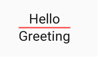
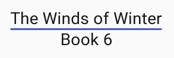
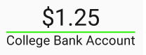

# LabelView

LabelView allows you to create lined-labeled views. 



LabelView will expand to fit the longest text. 



### How-to

```
 <ca.moosebytes.labelview.LabelView
      android:layout_width="wrap_content"
      android:layout_height="match_parent"
      app:textValue="Hello"
      app:labelValue="Greeting"
      app:lineColour="@color/colorPrimary"
      app:lineThickness="6"
      app:textSize="22sp"
      app:labelSize="22sp"/>
```

Change the top text:
`app:textValue` or `lblGreeting.setTextValue(String value)`
Change the label text:
`app:labelValue` or `lblGreeting.setLabelValue(String value)`
Change line colour
`app:lineColour` or `lblGreeting.setLineColour(int colour)`
Change line thickness
`app:lineThickness` or `lblGreeting.setLineThickness(float lineThickness)`

ie
```
app:textSize="50sp"
app:labelSize="28sp"
app:lineColour="@color/colorBankAccount
```
will result in;




